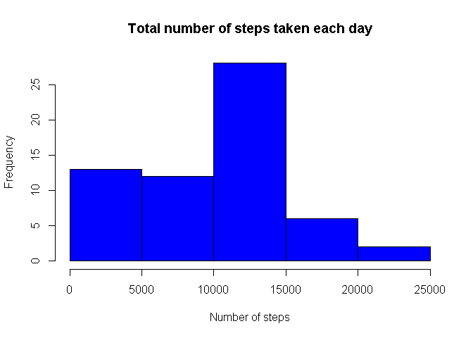
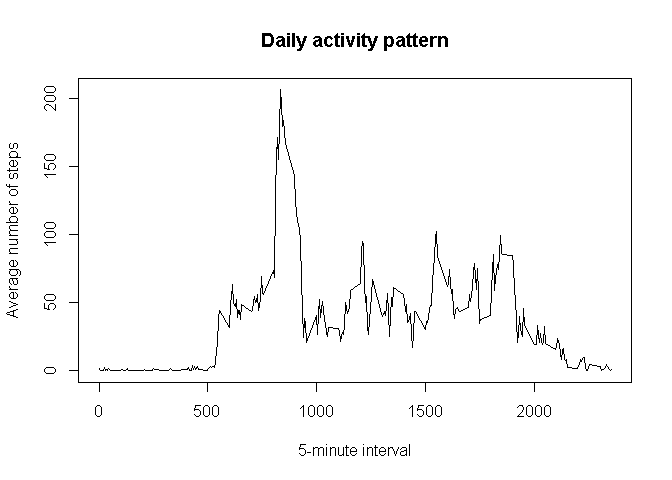
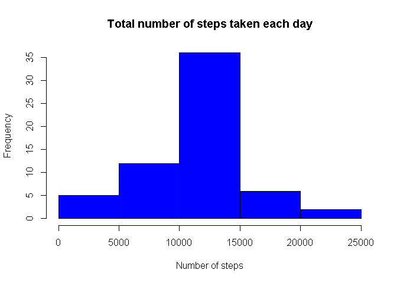
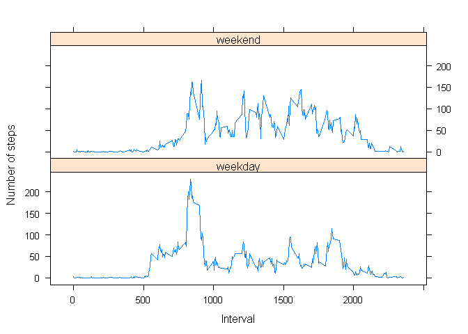

# Reproducible Research: Peer Assessment 1

## Description

This is the analysis of data from a personal activity monitoring device. This device collects data at 5 minute intervals through out the day. The data consists of two months of data from an anonymous individual collected during the months of October and November, 2012 and include the number of steps taken in 5 minute intervals each day.


## Loading required libraries and locale configuration


```r
# Loads dplyr library to manipulate data
library(dplyr)
```

```
## 
## Attaching package: 'dplyr'
## 
## The following object is masked from 'package:stats':
## 
##     filter
## 
## The following objects are masked from 'package:base':
## 
##     intersect, setdiff, setequal, union
```

```r
# Loads lattice library for plotting
library(lattice)

# Sets locale to work with weekdays in English language 
Sys.setlocale("LC_TIME", "English")
```

```
## [1] "English_United States.1252"
```

## Loading and preprocessing the data


```r
# Loads csv file provided, giving Date type to second field
data <- read.csv("activity.csv", colClasses = c(NA, "Date", NA))
```


## What is mean total number of steps taken per day?


```r
# Calculates the sum of steps grouping by date and ignoring NA values
steps_day <- group_by(data, date) %>% 
              summarize(steps = sum(steps, na.rm=TRUE))
```

The histogram that shows the total number of steps taken each day without considering NA:  


```r
hist(steps_day$steps, col="blue", main="Total number of steps taken each day", xlab="Number of steps")
```

 

```r
mean_step_day <- mean(steps_day$steps, na.rm=TRUE)

median_step_day <- median(steps_day$steps, na.rm=TRUE)
```

The mean is 9354.23 steps per day.  
The median is 10395 steps per day.  


## What is the average daily activity pattern?


```r
# Calculates the mean of steps grouping by interval and ignoring NA values
steps_interval <- group_by(data, interval) %>% 
                  summarize(steps = mean(steps, na.rm=TRUE))
```

The time series plot that shows the 5-minute interval and the average number of steps taken, averaged across all days:  


```r
plot(steps_interval, type ="l", main="Daily activity pattern", xlab="5-minute interval", ylab="Average number of steps")
```

 

```r
max_steps <- max(steps_interval$steps)
max_interval <- steps_interval[steps_interval$steps == max_steps,]$interval
```

The interval 835 is the one that contains the maximun number of steps (206.17).  

## Imputing missing values


```r
missing_values <- sum(is.na(data$steps))
```

The total number of missing values in the original data set is 2304.  

The strategy used to fill the missing values consists of using the mean for that 5-minute interval.


```r
# Joins original data and the mean by step interval generating a data set with not NA values
data_na_filled <- merge(data, steps_interval, by = "interval") %>% 
                  mutate(steps = ifelse(is.na(steps.x), round(steps.y), steps.x)) %>%
                  select(steps, date, interval)

missing_values <- sum(is.na(data_na_filled$steps))
```

The total number of missing values after setting the mean by step interval for NA values in the new data set is 0.  


```r
# Calculates the mean of steps grouping by interval
steps_day_na_filled <- group_by(data_na_filled, date) %>% 
                        summarize(steps = sum(steps))
```

The histogram that shows the total number of steps taken each day with all NA values replaced with the mean for the interval:  


```r
hist(steps_day_na_filled$steps, col="blue", main="Total number of steps taken each day", xlab="Number of steps")
```

 

```r
mean_step_day <- mean(steps_day_na_filled$steps)

median_step_day <- median(steps_day_na_filled$steps)
```

The mean is 10765.64 steps per day.  
The median is 10762 steps per day.  


## Are there differences in activity patterns between weekdays and weekends?


```r
# Adds factor indicating weekend or weekday for the corresponding date
data_na_filled <- mutate(data_na_filled, 
                         isweekend = as.factor(ifelse(weekdays(date) %in% c("Saturday", "Sunday"), "weekend", "weekday")))

# Calculates the mean of steps grouping by interval and weekday factor
steps_interval_weekday <- group_by(data_na_filled, interval, isweekend) %>% 
                          summarize(steps = mean(steps))
```

The panel plot containing a time series plot of the 5-minute interval and the average number of steps taken, averaged across all weekday days or weekend days:  


```r
xyplot(steps ~ interval | isweekend, data = steps_interval_weekday, layout = c(1, 2), type = "l", 
       xlab = "Interval", ylab = "Number of steps")
```

 

